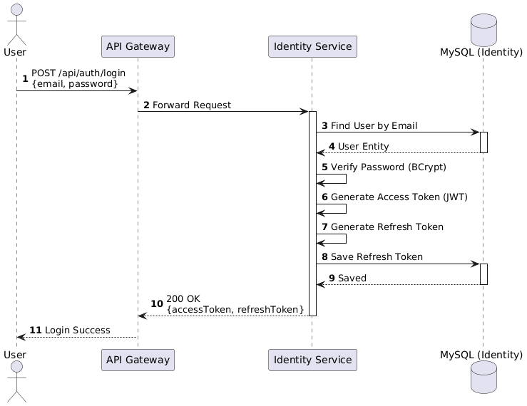
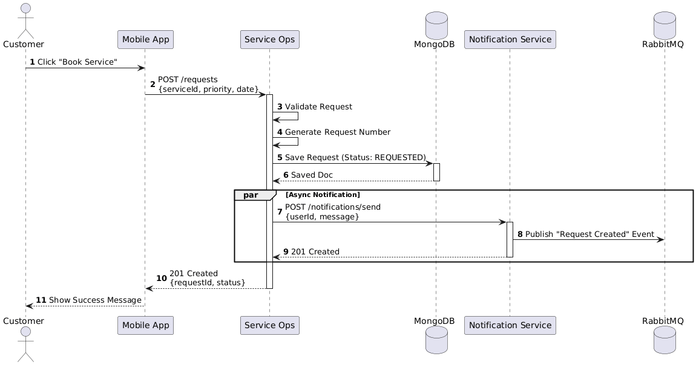
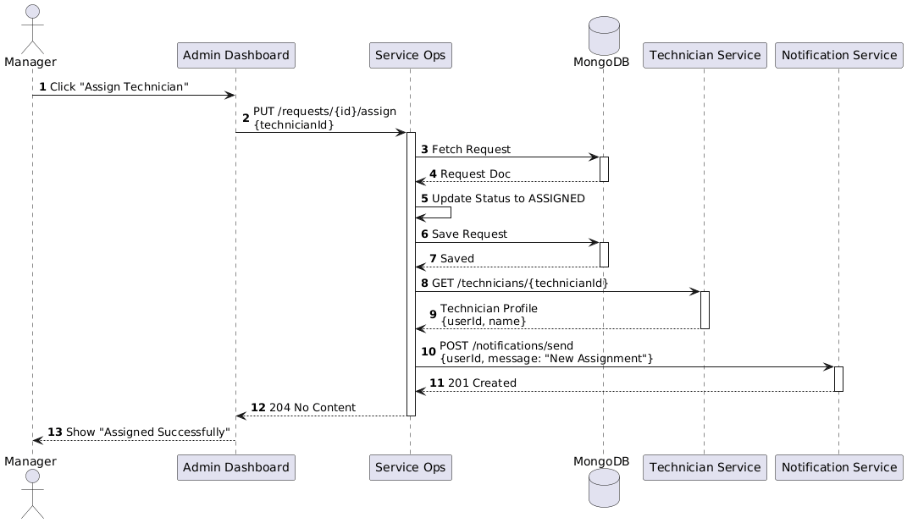
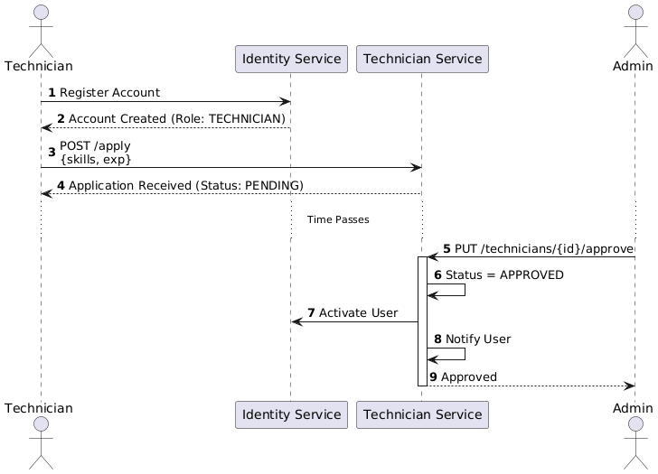
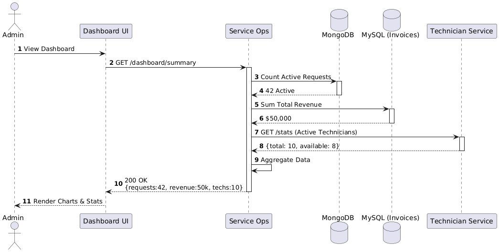
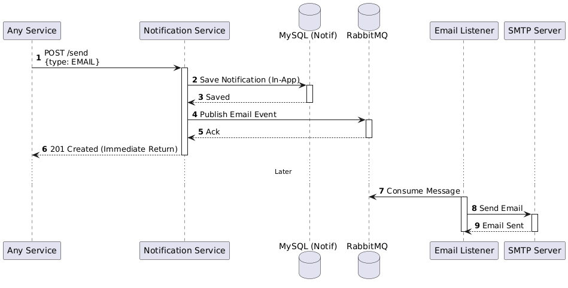
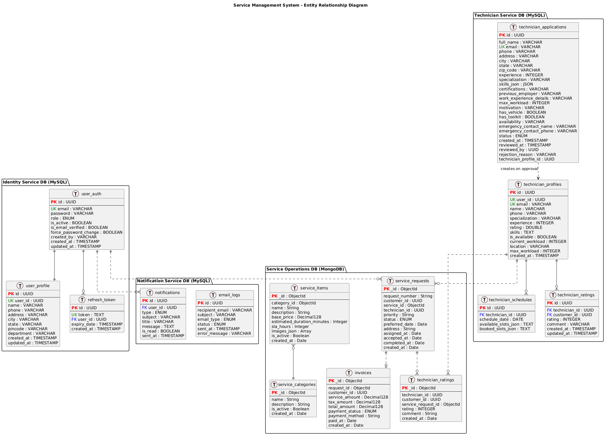

# Service Management System - Backend

A **microservices-based service management platform** built with Spring Boot and Spring Cloud, designed to handle service requests, technician management, user authentication, and notifications in a scalable and resilient architecture.

---

## Table of Contents

- [Overview](#overview)
- [Architecture](#architecture)
- [Microservices](#microservices)
- [Technology Stack](#technology-stack)
- [Database & Messaging](#database--messaging)
- [Getting Started](#getting-started)
- [API Gateway & Service Discovery](#api-gateway--service-discovery)
- [Sequence Diagrams](#sequence-diagrams)
- [Database Schema](#database-schema)
- [Configuration Management](#configuration-management)
- [Security](#security)
- [Development](#development)
- [Deployment](#deployment)
- [Testing](#testing)

---

## Overview

The Service Management System is an enterprise-grade platform that enables:
- **Customer service requests** with real-time tracking
- **Technician onboarding and management** with skill-based assignments
- **Smart technician assignment** based on workload, location, and ratings
- **Real-time notifications** via email and in-app messaging
- **Admin dashboard** with comprehensive analytics and reporting
- **Role-based access control** (Admin, Manager, Customer, Technician)

---

## Architecture

### High-Level Design


### Architecture Diagram


The system follows a **microservices architecture** with the following key components:

1. **API Gateway** - Single entry point for all client requests
2. **Eureka Server** - Service discovery and registry
3. **Config Server** - Centralized configuration management
4. **Business Services** - Domain-specific microservices
5. **Message Broker** - Asynchronous communication via RabbitMQ
6. **Databases** - Polyglot persistence (MySQL + MongoDB)

---

## Microservices

### 1. **Identity Service** (Port: 8081)
**Responsibilities:**
- User authentication and authorization
- JWT token generation and validation
- User registration (Customer, Manager, Technician)
- Password management and token refresh
- Role-based access control

**Database:** MySQL (`identity_db`)

**Key Features:**
- Secure password encryption with BCrypt
- JWT-based stateless authentication
- Refresh token mechanism
- Admin user seeding on startup

### 2. **Service Operations Service** (Port: 8083)
**Responsibilities:**
- Service catalog management (categories & services)
- Service request lifecycle management
- Technician assignment and workload balancing
- Billing and payment processing
- Admin dashboard analytics
- Revenue reporting

**Database:** MongoDB (`service_operations_db`)

**Key Features:**
- Smart technician assignment based on skills, location, and workload
- Real-time service request tracking
- Comprehensive admin reports
- Payment management

### 3. **Technician Service** (Port: 8084)
**Responsibilities:**
- Technician profile management
- Technician application and approval workflow
- Skills and specialization management
- Technician availability and workload tracking

**Database:** MySQL (`technician_db`)

**Key Features:**
- Multi-step technician onboarding
- Admin approval workflow
- Skills-based filtering
- Workload management

### 4. **Notification Service** (Port: 8082)
**Responsibilities:**
- Email notifications
- In-app notification management
- Notification templates
- Asynchronous message processing via RabbitMQ

**Database:** MySQL (`notification_db`)

**Key Features:**
- Email notifications for critical events
- In-app notification center
- Notification history tracking
- RabbitMQ integration for async processing

### 5. **API Gateway** (Port: 8080)
**Responsibilities:**
- Request routing to appropriate microservices
- JWT token validation
- Cross-cutting concerns (CORS, rate limiting)
- Load balancing

### 6. **Eureka Server** (Port: 8761)
**Responsibilities:**
- Service registration and discovery
- Health checks
- Load balancing support

### 7. **Config Server** (Port: 8888)
**Responsibilities:**
- Centralized configuration management
- Environment-specific configurations
- Dynamic configuration updates

---

## Technology Stack

### Core Framework
- **Java 17** - Programming language
- **Spring Boot 3.2.5** - Application framework
- **Spring Cloud 2023.0.3** - Microservices framework

### Spring Cloud Components
- **Spring Cloud Netflix Eureka** - Service discovery
- **Spring Cloud Gateway** - API Gateway
- **Spring Cloud Config** - Configuration management
- **Spring Cloud OpenFeign** - Declarative REST clients

### Security
- **Spring Security** - Authentication and authorization
- **JWT (JSON Web Tokens)** - Stateless authentication
- **BCrypt** - Password encryption

### Messaging
- **RabbitMQ** - Message broker for asynchronous communication
- **Spring AMQP** - RabbitMQ integration

### Build & Testing
- **Maven** - Build tool and dependency management
- **JUnit 5** - Unit testing
- **Mockito** - Mocking framework
- **Spring Boot Test** - Integration testing

### Code Quality
- **SonarQube** - Code quality and security analysis

---

## Database & Messaging

### Databases

| Service | Database Type | Database Name | Port |
|---------|--------------|---------------|------|
| Identity Service | MySQL 8 | `identity_db` | 3307 |
| Notification Service | MySQL 8 | `notification_db` | 3308 |
| Technician Service | MySQL 8 | `technician_db` | 3309 |
| Service Operations | MongoDB 7 | `service_operations_db` | 27018 |

### Message Broker
- **RabbitMQ 3 with Management Plugin** (Port: 5673, Management UI: 15673)

---

## Getting Started

### Prerequisites
- **Java 17** or higher
- **Maven 3.8+**
- **Docker & Docker Compose** (for containerized deployment)
- **MySQL 8** (if running locally)
- **MongoDB 7** (if running locally)
- **RabbitMQ 3** (if running locally)

### Environment Variables

Create a `.env` file in the root directory with the following variables:

```env
# Database Configuration
DB_USERNAME=identityuser
DB_PASSWORD=identitypass
DB_USERNAME_NOTIFICATION=notificationuser
DB_PASSWORD_NOTIFICATION=notificationpass
DB_USERNAME_TECHNICIAN=technicianuser
DB_PASSWORD_TECHNICIAN=technicianpass
MYSQL_ROOT_PASSWORD=rootpassword

# JWT Configuration
JWT_SECRET=your-256-bit-secret-key-here
JWT_ACCESS_TOKEN_EXPIRY=3600000
JWT_REFRESH_TOKEN_EXPIRY=86400000

# Admin User Configuration
ADMIN_EMAIL=admin@example.com
ADMIN_PASSWORD=admin123
ADMIN_NAME=Admin

# Email Configuration
MAIL_HOST=smtp.gmail.com
MAIL_PORT=587
MAIL_USERNAME=your-email@gmail.com
MAIL_PASSWORD=your-app-password

# RabbitMQ Configuration
RABBITMQ_USERNAME=guest
RABBITMQ_PASSWORD=guest
```

### Running with Docker Compose

1. **Clone the repository**
   ```bash
   git clone <repository-url>
   cd service-management-system-backend
   ```

2. **Build all services**
   ```bash
   mvn clean package -DskipTests
   ```

3. **Start all services**
   ```bash
   docker-compose up -d
   ```

4. **Check service health**
   ```bash
   docker-compose ps
   ```

5. **View logs**
   ```bash
   docker-compose logs -f <service-name>
   ```

6. **Stop all services**
   ```bash
   docker-compose down
   ```

### Running Locally (Without Docker)

1. **Start infrastructure services** (MySQL, MongoDB, RabbitMQ) using Docker or local installations

2. **Start services in order:**
   ```bash
   # 1. Eureka Server
   cd eureka-server
   mvn spring-boot:run

   # 2. Config Server
   cd config-server
   mvn spring-boot:run

   # 3. Business Services (in parallel)
   cd identity-service
   mvn spring-boot:run

   cd notification-service
   mvn spring-boot:run

   cd technician-service
   mvn spring-boot:run

   cd service-operations-service
   mvn spring-boot:run

   # 4. API Gateway
   cd api-gateway
   mvn spring-boot:run
   ```

---

## API Gateway & Service Discovery

### Service Registry
All microservices register with **Eureka Server** on startup:
- **Eureka Dashboard:** http://localhost:8761

### API Gateway Routes
The API Gateway routes requests to appropriate microservices:

| Path | Target Service | Port |
|------|----------------|------|
| `/api/auth/**` | Identity Service | 8081 |
| `/api/notifications/**` | Notification Service | 8082 |
| `/api/service-operations/**` | Service Operations | 8083 |
| `/api/technicians/**` | Technician Service | 8084 |

- **API Gateway Base URL:** http://localhost:8080

---

## Sequence Diagrams

### 1. Authentication Flow



**Flow:**
1. User submits login credentials
2. Identity Service validates credentials
3. JWT tokens (access + refresh) are generated
4. Tokens are returned to the client
5. Client includes JWT in subsequent requests

### 2. Service Request Flow



**Flow:**
1. Customer creates a service request
2. Service Operations Service validates and stores the request
3. Notification Service sends confirmation email
4. Manager views pending requests
5. Technician assignment process begins

### 3. Technician Assignment Flow



**Flow:**
1. Manager reviews service request
2. System suggests technicians based on skills and availability
3. Manager assigns technician
4. Notification sent to assigned technician
5. Service request status updated

### 4. Technician Onboarding Flow



**Flow:**
1. Technician submits application
2. Application stored in Technician Service
3. Admin reviews application
4. Admin approves/rejects application
5. Notification sent to technician
6. User credentials created (if approved)

### 5. Admin Dashboard Flow



**Flow:**
1. Admin requests dashboard statistics
2. Service Operations Service aggregates data
3. Dashboard metrics returned (total requests, revenue, technician stats)

### 6. Notification Receive Flow



**Flow:**
1. Event triggers notification (e.g., service request created)
2. Message published to RabbitMQ
3. Notification Service consumes message
4. Email sent via SMTP
5. In-app notification stored in database

---

## Database Schema

### Entity Relationship Diagram



### Key Entities

**Identity Service:**
- `users` - User accounts (Customer, Manager, Technician, Admin)
- `roles` - User roles
- `refresh_tokens` - JWT refresh tokens

**Notification Service:**
- `notifications` - In-app notifications
- `notification_templates` - Email templates

**Technician Service:**
- `technicians` - Technician profiles
- `technician_applications` - Onboarding applications
- `skills` - Technician skills and specializations

**Service Operations Service:**
- `categories` - Service categories
- `services` - Available services
- `service_requests` - Customer service requests
- `billing` - Payment and billing records

---

## Configuration Management

Configuration is centralized using **Spring Cloud Config Server**:

- **Repository:** Configuration files are stored in a Git repository or local filesystem
- **Profiles:** Environment-specific configurations (dev, docker, prod)
- **Dynamic Refresh:** Configurations can be updated without restarting services

### Configuration Locations
- `config-server/src/main/resources/config/` - Local configuration files

---

## Security

### Authentication & Authorization
- **JWT-based authentication** for stateless security
- **Role-based access control (RBAC)** with roles: `ADMIN`, `MANAGER`, `CUSTOMER`, `TECHNICIAN`
- **Password encryption** using BCrypt
- **Token refresh mechanism** for extended sessions

### API Gateway Security
- JWT validation at gateway level
- CORS configuration for cross-origin requests
- Request filtering and rate limiting

### Inter-Service Communication
- Services communicate via **OpenFeign** clients
- Service discovery via Eureka ensures secure routing

---

## Development

### Project Structure
```
service-management-system-backend/
├── api-gateway/              # API Gateway service
├── config-server/            # Configuration server
├── eureka-server/            # Service registry
├── identity-service/         # Authentication & user management
├── notification-service/     # Notification management
├── service-operations-service/  # Core business logic
├── technician-service/       # Technician management
├── pictures/                 # Architecture diagrams
├── docker-compose.yml        # Docker orchestration
├── pom.xml                   # Parent POM
└── README.md                 # This file
```

### Building the Project

```bash
# Build all modules
mvn clean install

# Build without tests
mvn clean install -DskipTests

# Build specific module
cd <service-name>
mvn clean package
```

### Code Quality Analysis

```bash
# Run SonarQube analysis
mvn clean verify sonar:sonar \
  -Dsonar.host.url=http://localhost:9000 \
  -Dsonar.login=<your-token>
```

---

## Deployment

### Docker Deployment

All services are containerized with `Dockerfile`:

```bash
# Build and run all services
docker-compose up --build -d

# Scale specific services
docker-compose up -d --scale identity-service=2

# View service logs
docker-compose logs -f identity-service
```

### Health Checks

Each service exposes health endpoints:
- **Actuator Health:** `/actuator/health`
- **Eureka Apps:** http://localhost:8761/eureka/apps

---

## Testing

### Running Tests

```bash
# Run all tests
mvn test

# Run tests for specific module
cd identity-service
mvn test

# Run tests with coverage
mvn clean verify
```

### Test Coverage
- Code coverage is measured using **JaCoCo**
- Coverage reports available in `target/site/jacoco/index.html`

### Integration Tests
- Spring Boot Test framework
- Testcontainers for database integration tests
- MockMvc for controller testing

---

## Additional Resources

### Management Endpoints
- **Eureka Dashboard:** http://localhost:8761
- **RabbitMQ Management:** http://localhost:15673
- **API Gateway:** http://localhost:8080

### Default Admin Credentials
- **Email:** admin@example.com
- **Password:** admin123

> **Important:** Change default credentials in production!

---

## Contributors

Developed as part of the **Chubb Capstone Project**.

---

## License

This project is proprietary and confidential.

---

## Support

For questions or support, please contact the development team.

---

**Built with Spring Boot and Spring Cloud**
